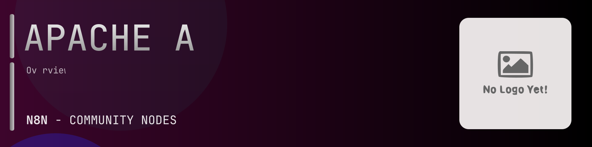

# @n8n-dev/n8n-nodes-apache-airflow



[](https://www.npmjs.com/package/@n8n-dev/n8n-nodes-apache-airflow)
[](https://opensource.org/licenses/MIT)

---

**Stop writing apache-airflow API integrations by hand.**

Every time you connect n8n to apache-airflow, you waste hours mapping endpoints, defining parameters, and debugging schemas. You copy-paste from docs, fix edge cases, and pray nothing breaks.

**What if connecting n8n to apache-airflow took 5 minutes, not half a day?**

This node gives you **18+ resources** out of the box: **Config**, **Connection**, **DAG**, **DAG Run**, **Event Log**, and 13 more: with full CRUD operations, typed parameters, and zero manual configuration.

---

## What You Get

- **Zero boilerplate**: Resources, operations, and fields are pre-configured and ready to use
- **Full CRUD**: Create, read, update, and delete support where the API allows it
- **Typed parameters**: No more guessing field types
- **Built-in auth**: API key authentication, ready to go
- **Declarative**: Native n8n performance, no custom execute() overhead

---

## Install

```bash
npm install @n8n-dev/n8n-nodes-apache-airflow
```

**Or in n8n:**
1. **Settings → Community Nodes → Install**
2. Search: `@n8n-dev/n8n-nodes-apache-airflow`
3. Click **Install**

---

## Quick Start

1. Install the node (above)
2. Add credentials: **apache-airflow API** → paste your API key
3. Drag the **apache-airflow** node into your workflow
4. Pick a resource → pick an operation → done.

That's it. No configuration files. No code. It just works.

---

## Resources

<details>
<summary><b>Config</b> (1 operations)</summary>

- Get current configuration

</details>

<details>
<summary><b>Connection</b> (6 operations)</summary>

- Get List connections
- Post Create a connection
- Post Test a connection
- Delete a connection
- Get a connection
- Patch Update a connection

</details>

<details>
<summary><b>DAG</b> (11 operations)</summary>

- Get a source code
- Get List DAGs
- Patch Update DAGs
- Delete a DAG
- Get basic information about a DAG
- Patch Update a DAG
- Post Clear a set of task instances
- Get a simplified representation of DAG
- Get tasks for DAG
- Get simplified representation of a task
- Post Set a state of task instances

</details>

<details>
<summary><b>DAG Run</b> (9 operations)</summary>

- Get List DAG runs
- Post Trigger a new DAG run
- Delete a DAG run
- Get a DAG run
- Patch Modify a DAG run
- Post Clear a DAG run
- Patch Update the DagRun note
- Get dataset events for a DAG run
- Post List DAG runs batch

</details>

<details>
<summary><b>Event Log</b> (2 operations)</summary>

- Get List log entries
- Get a log entry

</details>

<details>
<summary><b>Import Error</b> (2 operations)</summary>

- Get List import errors
- Get an import error

</details>

<details>
<summary><b>Monitoring</b> (2 operations)</summary>

- Get instance status
- Get version information

</details>

<details>
<summary><b>Pool</b> (5 operations)</summary>

- Get List pools
- Post Create a pool
- Delete a pool
- Get a pool
- Patch Update a pool

</details>

<details>
<summary><b>Provider</b> (1 operations)</summary>

- Get List providers

</details>

<details>
<summary><b>Task Instance</b> (11 operations)</summary>

- Get List task instances
- Get a task instance
- Patch Updates the state of a task instance
- Get List extra links
- Get List mapped task instances
- Get logs
- Patch Update the TaskInstance note
- Get a mapped task instance
- Patch Updates the state of a mapped task instance
- Patch Update the TaskInstance note
- Post List task instances batch

</details>

<details>
<summary><b>Variable</b> (5 operations)</summary>

- Get List variables
- Post Create a variable
- Delete a variable
- Get a variable
- Patch Update a variable

</details>

<details>
<summary><b>X Com</b> (2 operations)</summary>

- Get List XCom entries
- Get an XCom entry

</details>

<details>
<summary><b>Plugin</b> (1 operations)</summary>

- Get a list of loaded plugins

</details>

<details>
<summary><b>Role</b> (5 operations)</summary>

- Get List roles
- Post Create a role
- Delete a role
- Get a role
- Patch Update a role

</details>

<details>
<summary><b>Permission</b> (1 operations)</summary>

- Get List permissions

</details>

<details>
<summary><b>User</b> (5 operations)</summary>

- Get List users
- Post Create a user
- Delete a user
- Get a user
- Patch Update a user

</details>

<details>
<summary><b>Dag Warning</b> (1 operations)</summary>

- Get List dag warnings

</details>

<details>
<summary><b>Dataset</b> (4 operations)</summary>

- Get dataset events for a DAG run
- Get List datasets
- Get dataset events
- Get a dataset

</details>

---

## Why This Node?

**Without this node:**
- Hours of manual API integration
- Copy-pasting from apache-airflow docs
- Debugging auth, pagination, error handling
- Maintaining your own client code

**With this node:**
- Install → configure → use. 5 minutes.
- Auto-generated from the official apache-airflow OpenAPI spec
- Always up to date when the API changes
- Native n8n performance

---

## Auto-Generated
This node was auto-generated from the official **apache-airflow** OpenAPI specification using
[@n8n-dev/n8n-openapi-node-ultimate](https://github.com/kelvinzer0/n8n-openapi-node-ultimate),
then validated against the live API so you get accurate types and real parameters, not guesswork.

When the apache-airflow API updates, this node updates too.

---


## License

MIT © [kelvinzer0](https://github.com/n8n-code)
